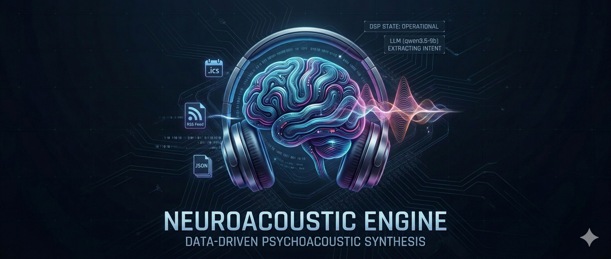
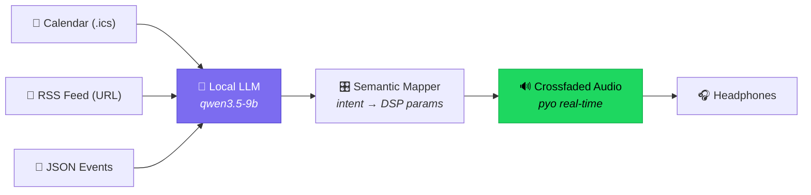
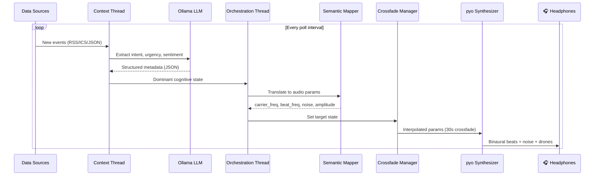
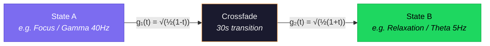

<p align="center">
  
</p>

# NeuroAcoustic Engine

A local, real-time generative audio system that translates daily data streams and cognitive states into a voiceless acoustic language using psychoacoustic research.

**[Listen to the samples →](https://valter-silva-au.github.io/neuro-acustic-engine/)**

---

## What It Does

The engine ingests your calendar, RSS feeds, or event files — classifies them using a local LLM — and generates scientifically grounded audio that adapts to your cognitive needs throughout the day.



| Your Schedule Says | Engine Produces | Why |
|---|---|---|
| "Deep work: System design" | 40 Hz gamma binaural + pink noise | Gamma enhances working memory and attention |
| "Team standup" | 16 Hz beta binaural + pink noise | Beta supports sustained focus |
| "Lunch break" | 5 Hz theta + brown noise | Theta promotes relaxation and recovery |
| "Study: ML course" | 40 Hz gamma + 528 Hz carrier | Gamma aids memory formation and learning |
| "URGENT: Prod is down" | 20 Hz beta, high amplitude, bright timbre | Alertness state with urgency modifiers |

## What It Looks Like

```
$ python -m neuroacoustic --rss http://feeds.bbci.co.uk/news/rss.xml --poll-interval 30

════════════════════════════════════════════════════════════════
NeuroAcoustic Engine
════════════════════════════════════════════════════════════════

────────────────────────────────────────────────────────────────
  22:44:31  ▲ ALERTNESS / beta
────────────────────────────────────────────────────────────────
  Source:    [rss] How has Iran responded and which countries has it attacked?
  Link:      https://www.bbc.com/news/articles/cx2dyz6p3weo
  Summary:   Breaking news report on the escalation of conflict in the Middle
             East following US and Israeli strikes on Iran.
  Content:   (full article fetched and analyzed)

  Intent:    alertness     Urgency:   █ critical
  Sentiment: - negative    Brightness: ██░░░░░░░░ 0.2

  Carrier:     224.0 Hz    Beat:   30.0 Hz (beta)
  Amplitude:    0.80        Noise: white

  Analyzed 5 items: alertness:3 / relaxation:2
  Headlines:
    • How has Iran responded and which countries has it attacked?
    • Rachel Zegler nominated for Olivier after balcony performance of Evita
    • BBC suggests licence fee could be cut if more people pay
    • My natural way of playing has been coached out of me, says Raducanu
    • Trying to get social care can be 'horrendous', Baroness Casey tells BBC

────────────────────────────────────────────────────────────────
  22:45:13  ■ LEARNING / gamma
────────────────────────────────────────────────────────────────
  Source:    [rss] Championship play-offs expanded from four to six teams
  Link:      https://www.bbc.com/sport/football/articles/c4g00mr00zdo
  Summary:   EFL clubs voted to expand Championship play-offs from four to six
             teams starting the 2026-27 season.
  Content:   (full article fetched and analyzed)

  Intent:    learning      Urgency:   ▒ medium
  Sentiment: ○ neutral     Brightness: █████░░░░░ 0.5

  Carrier:     528.0 Hz    Beat:   40.0 Hz (gamma)
  Amplitude:    0.30        Noise: pink

  Analyzed 5 items: learning:3 / alertness:1 / relaxation:1
  Headlines:
    • Championship play-offs expanded from four to six teams next season
    • Norris, Verstappen, Russell - and will it be any good? Key F1 storylines
    • How relegation could cost Spurs more than £250m
    • My natural way of playing has been coached out of me - Raducanu
    • Osula stunner sinks Man Utd - 12 years after winning skills contest
```

Each block shows:
- **Timestamp + dominant state** — the icon and brainwave band the engine selected
- **Source content** — article title, link, LLM-generated summary, and whether the full article was fetched
- **Analysis** — intent, urgency (bar), sentiment (icon), timbre brightness (bar)
- **Audio parameters** — carrier frequency, beat frequency, band, noise color, amplitude
- **Aggregation** — how many items were analyzed and the intent distribution across them

## Quick Start

### Listen in the Browser

Visit **[valter-silva-au.github.io/neuro-acustic-engine](https://valter-silva-au.github.io/neuro-acustic-engine/)** — 27 samples across 6 categories with a multi-track mixer, loop controls, per-track volume, and real-time waveform visualization. No install required.

### Install Locally

```bash
git clone https://github.com/valter-silva-au/neuro-acustic-engine.git
cd neuro-acustic-engine

# System deps (Linux — pyo needs PortAudio)
sudo apt install libportaudio2 portaudio19-dev libsndfile1-dev liblo-dev

# Python setup
python3 -m venv .venv && source .venv/bin/activate
pip install -e ".[dev]"

# Verify
python -m pytest tests/ -v  # 111 tests
```

### Run the Engine

**With a calendar file:**

```bash
python -m neuroacoustic --calendar ~/my-calendar.ics --duration 300
```

**With an RSS feed:**

```bash
python -m neuroacoustic --rss https://news.ycombinator.com/rss
```

**With a watch directory (drop JSON events in real-time):**

```bash
python -m neuroacoustic --watch-dir ./events/ &

# Drop events — audio changes immediately
echo '{"intent":"focus","urgency":"high","sentiment":"neutral"}' > events/work.json
sleep 30
echo '{"intent":"relaxation","urgency":"low","sentiment":"positive"}' > events/break.json
```

**Full options:**

```
python -m neuroacoustic \
  --calendar ~/calendar.ics \
  --rss https://feeds.example.com/tech.xml \
  --watch-dir ./events/ \
  --poll-interval 60 \
  --crossfade-duration 30 \
  --llm-backend ollama \
  --duration 3600
```

## How It Works



### 1. Ingestion

The engine polls data sources for new information:

- **ICS Calendar** — Parses `.ics` files using the `icalendar` library. Extracts event titles, descriptions, times, and durations.
- **RSS/Atom Feeds** — Parses feeds using `feedparser`. Extracts headlines, summaries, and publication dates.
- **File Watcher** — Monitors a directory for `.json` files. Useful for integrating with other tools or manual testing.

### 2. LLM Classification

Each piece of text is classified by a local LLM running via [Ollama](https://ollama.com/):

```json
{
  "intent": "focus",         // focus | relaxation | alertness | learning
  "urgency": "high",         // low | medium | high | critical
  "sentiment": "neutral",    // positive | neutral | negative
  "data_source": "calendar",
  "content_summary": "Deep work coding session"
}
```

The engine uses **qwen3.5-9b** by default (runs on CPU, ~6 GB RAM). Falls back to keyword matching if Ollama isn't available.

### 3. Semantic-to-Acoustic Translation

The `SemanticMapper` converts classified events into DSP parameters using psychoacoustic research:

| Intent | Beat Frequency | Carrier | Noise | Brainwave Band |
|---|---|---|---|---|
| Focus | 40 Hz | 432 Hz | Pink | Gamma |
| Relaxation | 5 Hz | 110 Hz | Brown | Theta |
| Alertness | 20 Hz | 250 Hz | White | Beta |
| Learning | 40 Hz | 528 Hz | Pink | Gamma |

**Modifiers** layer on top:
- **High urgency** → 1.25× beat frequency, +0.3 amplitude, +30 Hz carrier shift
- **Positive sentiment** → 1.5× carrier (perfect fifth interval), brighter timbre
- **Negative sentiment** → 0.8× carrier, darker timbre

### 4. Synthesis

The `CognitiveAudioSynthesizer` uses the [pyo](https://github.com/belangeo/pyo) framework (C-based DSP) for real-time audio:

- **Binaural beats** — Two sine oscillators panned L/R with `SigTo` interpolation for click-free transitions
- **Isochronic tones** — Amplitude-modulated carriers with smoothed pulse envelopes
- **Colored noise** — FFT-based spectral shaping (white = flat, pink = 1/f, brown = 1/f²)
- **FM drones** — Frequency-modulated harmonic stacks

### 5. Crossfading

State transitions use **constant-power crossfading** over 30 seconds:



At the midpoint both signals are at √0.5 ≈ 0.707 amplitude, maintaining constant perceived loudness.

## Project Structure

```mermaid
graph TD
    ROOT["src/neuroacoustic/"] --> CORE["core/"]
    ROOT --> ING["ingestion/"]
    ROOT --> TRANS["translation/"]
    ROOT --> SYNTH["synthesis/"]
    ROOT --> ORCH["orchestration/"]
    ROOT --> MAIN["__main__.py<br/><i>CLI entry point</i>"]

    CORE --> C1["config.py<br/><i>Brainwave bands, intent profiles</i>"]
    CORE --> C2["state_manager.py<br/><i>Thread-safe state container</i>"]

    ING --> I1["calendar_parser.py<br/><i>ICS file parsing</i>"]
    ING --> I2["rss_parser.py<br/><i>RSS/Atom + article fetching</i>"]
    ING --> I3["llm_agent.py<br/><i>Ollama LLM + mock fallback</i>"]

    TRANS --> T1["semantic_mapper.py<br/><i>Intent → audio parameters</i>"]
    TRANS --> T2["timbre_space.py<br/><i>Spectral centroid, attack, inharmonicity</i>"]

    SYNTH --> S1["dsp_engine.py<br/><i>pyo real-time synthesizer</i>"]
    SYNTH --> S2["binaural.py<br/><i>Binaural beat helpers</i>"]
    SYNTH --> S3["isochronic.py<br/><i>Isochronic tone generation</i>"]
    SYNTH --> S4["noise_generators.py<br/><i>White/pink/brown noise via FFT</i>"]
    SYNTH --> S5["streaming.py<br/><i>Chunked WAV writer</i>"]

    ORCH --> O1["execution_loop.py<br/><i>3-thread architecture</i>"]
    ORCH --> O2["crossfader.py<br/><i>Constant-power crossfade</i>"]

    style ROOT fill:#7c6cf0,stroke:#5a4bd4,color:#fff
    style CORE fill:#1a1a2e,stroke:#7c6cf0,color:#eee
    style ING fill:#1a1a2e,stroke:#1ed760,color:#eee
    style TRANS fill:#1a1a2e,stroke:#50c8f0,color:#eee
    style SYNTH fill:#1a1a2e,stroke:#f0a050,color:#eee
    style ORCH fill:#1a1a2e,stroke:#e55565,color:#eee
```



## Examples — Copy & Paste

**Learning mode** — academic papers, gamma entrainment:
```bash
python -m neuroacoustic --rss http://arxiv.org/rss/cs.AI --poll-interval 30
```

**Focus mode** — GitHub trending repos, deep work:
```bash
python -m neuroacoustic --rss https://mshibanami.github.io/GitHubTrendingRSS/daily/all.xml --poll-interval 30
```

**News alertness** — BBC News, breaking stories:
```bash
python -m neuroacoustic --rss http://feeds.bbci.co.uk/news/rss.xml --poll-interval 30
```

**Mixed cognitive states** — Hacker News rotates through learning, focus, alertness:
```bash
python -m neuroacoustic --rss https://news.ycombinator.com/rss --poll-interval 30
```

**Your actual workday** — export from Google Calendar (Settings → Import & Export):
```bash
python -m neuroacoustic --calendar ~/Downloads/my-calendar.ics --poll-interval 30
```

**Calendar + news combined:**
```bash
python -m neuroacoustic \
  --calendar ~/Downloads/my-calendar.ics \
  --rss https://news.ycombinator.com/rss \
  --poll-interval 30 --crossfade-duration 15
```

**Script your own acoustic day** — drop JSON events in real-time:
```bash
python -m neuroacoustic --watch-dir ./events/ --poll-interval 5 &

# Morning deep work
echo '{"intent":"focus","urgency":"high","sentiment":"positive","content_summary":"Deep work: building the auth module"}' > events/01.json
sleep 30

# Production incident
echo '{"intent":"alertness","urgency":"critical","sentiment":"negative","content_summary":"INCIDENT: Database connection pool exhausted"}' > events/02.json
sleep 30

# Lunch break
echo '{"intent":"relaxation","urgency":"low","sentiment":"positive","content_summary":"Lunch break — grab a coffee and stretch"}' > events/03.json
sleep 30

# Afternoon learning
echo '{"intent":"learning","urgency":"medium","sentiment":"positive","content_summary":"Team tech talk: Introduction to WebAssembly"}' > events/04.json
```

## Integrating Your Data Sources

### Google Calendar

Export your calendar as `.ics` from Google Calendar (Settings → Import & Export → Export) and point the engine at it:

```bash
python -m neuroacoustic --calendar ~/Downloads/my-calendar.ics
```

For continuous syncing, use a tool like [vdirsyncer](https://github.com/pimutils/vdirsyncer) to sync CalDAV to local `.ics` files, then point the engine at the synced file.

### Apple Calendar

Export from Calendar.app → File → Export → Export..., or sync via CalDAV with vdirsyncer.

### RSS / News Feeds

Any RSS or Atom feed URL works:

```bash
# Hacker News
python -m neuroacoustic --rss https://news.ycombinator.com/rss

# BBC News
python -m neuroacoustic --rss http://feeds.bbci.co.uk/news/rss.xml

# Multiple sources (run multiple instances or extend the CLI)
python -m neuroacoustic --rss https://feed1.example.com --rss https://feed2.example.com
```

### Custom Integration (JSON Events)

For anything else, use the watch directory. Any tool that can write a JSON file can feed the engine:

```bash
python -m neuroacoustic --watch-dir ./events/

# Your script, cron job, or webhook writes:
cat > events/slack-alert.json << 'EOF'
{
  "intent": "alertness",
  "urgency": "critical",
  "sentiment": "negative",
  "data_source": "slack",
  "content_summary": "Production deploy failed - rollback needed"
}
EOF
```

### Programmatic Use (Python API)

```python
from neuroacoustic.ingestion.llm_agent import create_agent
from neuroacoustic.translation.semantic_mapper import SemanticMapper
import json

agent = create_agent("ollama")  # or "mock" for no LLM
mapper = SemanticMapper()

# Classify any text
metadata = agent.extract_metadata("Deep work: refactoring auth module", "calendar")
params = mapper.translate_payload(metadata)

print(params)
# {'carrier_freq': 432.0, 'beat_freq': 40.0, 'target_amplitude': 0.3,
#  'noise_color': 'pink', 'target_band': 'gamma', ...}
```

## Generate Audio Files

```bash
# 27 showcase samples (2 min each, 272 MB)
python examples/generate_showcase.py

# 8-hour focus playlist (7 tracks, 16.5 GB)
python examples/generate_focus_playlist.py

# 8-hour relaxation playlist (7 tracks, 16.5 GB)
python examples/generate_relaxation_playlist.py
```

## Requirements

| Dependency | Purpose | Required? |
|---|---|---|
| Python 3.9+ | Runtime | Yes |
| pyo | Real-time DSP synthesis | Yes |
| numpy | Audio generation, FFT | Yes |
| icalendar | ICS calendar parsing | Yes |
| feedparser | RSS/Atom feed parsing | Yes |
| requests | Ollama API communication | Yes |
| [Ollama](https://ollama.com/) + qwen3.5-9b | Local LLM classification | Optional (falls back to keyword matching) |
| PortAudio, libsndfile, liblo | System audio libraries (Linux) | Yes (for pyo) |

## Research References

The audio parameters are grounded in peer-reviewed psychoacoustic research:

| Technique | Frequency | Effect | Citation |
|---|---|---|---|
| Gamma binaural (40 Hz) | 40 Hz | Memory encoding, attention | Jirakittayakorn & Wongsawat, 2017 |
| Beta binaural (16 Hz) | 16 Hz | Sustained attention (SMR) | Egner & Gruzelier, 2004 |
| Theta binaural (6 Hz) | 6 Hz | Meditation, anxiety reduction | Lavallee et al., 2011 |
| Alpha binaural (10 Hz) | 10 Hz | Cortisol reduction | Huang & Charyton, 2008 |
| Delta binaural (2 Hz) | 2 Hz | Deep sleep facilitation | Jirakittayakorn & Wongsawat, 2017 |
| Isochronic tones | Various | Stronger cortical response than binaural | Schwarz & Taylor, 2005 |
| Pink noise | 1/f spectrum | Sleep quality, memory | Zhou et al., 2012 |
| Alpha-gamma coupling | 10 Hz + 40 Hz | Flow state induction | Katahira et al., 2018 |

## Roadmap — Vote on What's Next!

This project is **community-driven**. Vote with :+1: on the issues you want built first.

| Feature | Status | Vote |
|---|---|---|
| [CalDAV live sync](https://github.com/valter-silva-au/neuro-acustic-engine/issues/6) — real-time calendar without file export | Planned | [Vote](https://github.com/valter-silva-au/neuro-acustic-engine/issues/6) |
| [Spotify / Apple Music integration](https://github.com/valter-silva-au/neuro-acustic-engine/issues/7) — adapt to current playback | Planned | [Vote](https://github.com/valter-silva-au/neuro-acustic-engine/issues/7) |
| [EEG biofeedback loop](https://github.com/valter-silva-au/neuro-acustic-engine/issues/8) — closed-loop brainwave adaptation | Planned | [Vote](https://github.com/valter-silva-au/neuro-acustic-engine/issues/8) |
| [Spatial audio / 3D](https://github.com/valter-silva-au/neuro-acustic-engine/issues/9) — HRTF immersive positioning | Planned | [Vote](https://github.com/valter-silva-au/neuro-acustic-engine/issues/9) |
| [Session analytics](https://github.com/valter-silva-au/neuro-acustic-engine/issues/10) — track cognitive patterns | Planned | [Vote](https://github.com/valter-silva-au/neuro-acustic-engine/issues/10) |
| [Plugin system](https://github.com/valter-silva-au/neuro-acustic-engine/issues/11) — custom data sources & audio | Planned | [Vote](https://github.com/valter-silva-au/neuro-acustic-engine/issues/11) |
| [MIDI / OSC output](https://github.com/valter-silva-au/neuro-acustic-engine/issues/12) — trigger external synths & DAWs | Planned | [Vote](https://github.com/valter-silva-au/neuro-acustic-engine/issues/12) |
| [Docker container](https://github.com/valter-silva-au/neuro-acustic-engine/issues/13) — one-command setup | Planned | [Vote](https://github.com/valter-silva-au/neuro-acustic-engine/issues/13) |
| [Mobile companion](https://github.com/valter-silva-au/neuro-acustic-engine/issues/14) — control from your phone | Planned | [Vote](https://github.com/valter-silva-au/neuro-acustic-engine/issues/14) |

**Have a different idea?** [Tell us what you want →](https://github.com/valter-silva-au/neuro-acustic-engine/issues/15)

## License

MIT

## Contributing

Issues and PRs welcome! Check the [roadmap issues](https://github.com/valter-silva-au/neuro-acustic-engine/issues?q=label%3Aroadmap) for planned features, or [open a feature request](https://github.com/valter-silva-au/neuro-acustic-engine/issues/15) to suggest something new.
